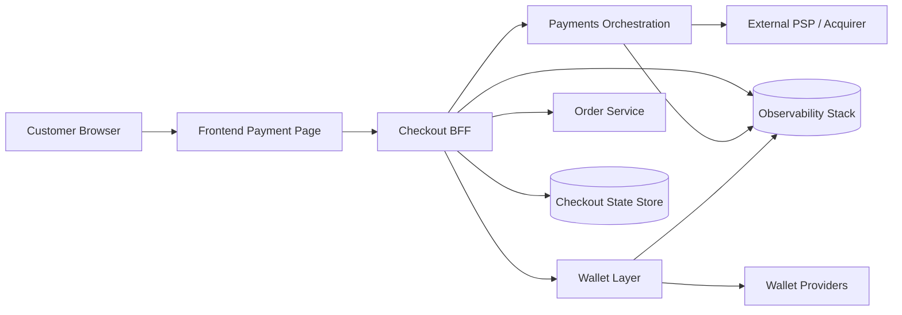

# Checkout Architecture

## Elevator Pitch
Decoupled checkout architecture with a BFF, payment orchestration, wallet abstraction layer, and resilient state management to support multiple payment methods at enterprise scale.

## Objective
- Design an enterprise-grade checkout.
- Separate UI, BFF, and payments orchestration concerns.
- Support wallet and card payment methods.
- Handle failures, retries, and graceful recovery.
- Enable state recovery for interrupted sessions.
- Provide end-to-end funnel observability.

## High-Level Architecture



## Repository Structure

```text
checkout-architecture/
 ├─ frontend/
 ├─ bff/
 ├─ payments/
 ├─ wallets/
 ├─ state/
 ├─ flows/
 ├─ errors/
 └─ docs/
```

## Design Principles
1. **Loose coupling**: keep rendering, orchestration, and provider integrations independent.
2. **Resilience first**: retries, idempotency, and fallback are first-class concerns.
3. **State-driven workflow**: state machine controls legal transitions and recovery.
4. **Observability by design**: every critical step emits metrics and traces.
5. **Provider-agnostic integrations**: payment and wallet interfaces avoid lock-in.

## Pseudocode: End-to-End Flow

```text
Frontend:
  loadPaymentOptions()
  userSelectsMethod(method)
  POST /execute-payment with checkoutId + method + tokenizedData
  if response.requires3DS: redirect/challenge
  poll or resume checkout until SUCCESS|FAILED

BFF:
  validate request
  read state
  call orchestration clients
  persist state transitions
  return normalized response contract

Payments:
  execute authorization/capture workflow
  map provider-specific statuses to domain statuses
  return orchestration result
```

## Anonymization Disclaimers
- This repository illustrates a generic checkout architecture.
- All service names are generic.
- No company-specific flows are represented.
- No proprietary APIs are included.
- Timing, states, and flows are simplified.
- Architecture is illustrative only.

## Estructura documental agregada

- `markdown/`: documentación técnica y funcional en Markdown.
- `diagramas/`: diagramas de arquitectura y flujos (Mermaid u otros formatos).
- `openapi/`: especificaciones OpenAPI del dominio.
- `ejemplos-json/`: ejemplos de payloads de request/response.
- `adrs/`: registros de decisiones arquitectónicas.
