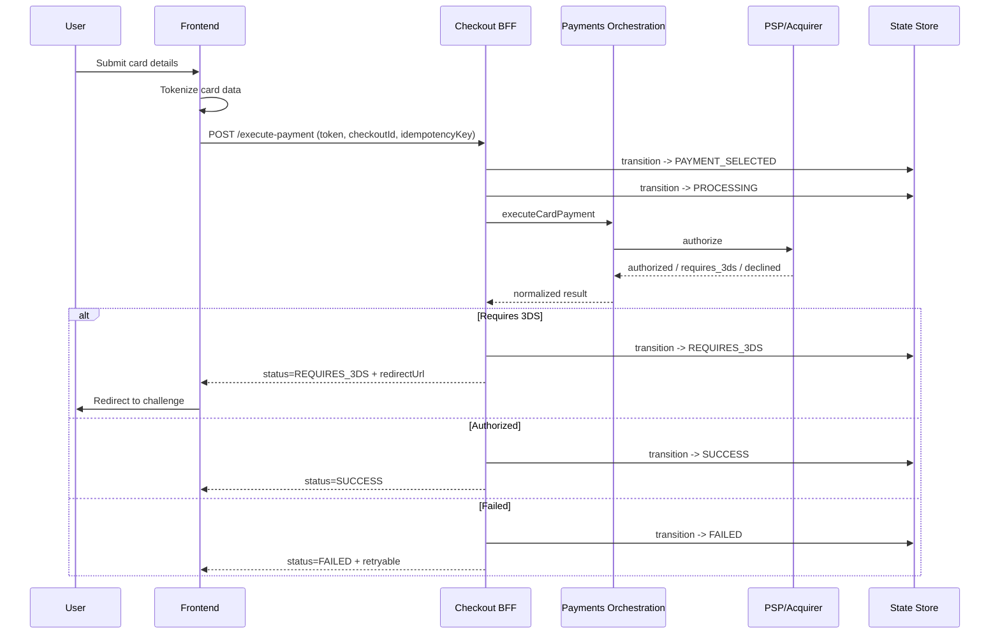

# Card Payment Sequence

## Key Failure Points
- Tokenization failure at frontend.
- BFF timeout to orchestration.
- PSP soft decline requiring retry.
- Customer abandonment during 3DS.

## Retry Strategy
- Reuse checkout session, new idempotency key only for new business attempt.
- Keep provider-level idempotency for network retries.
- Limit customer-visible retries to avoid duplicate intents.
