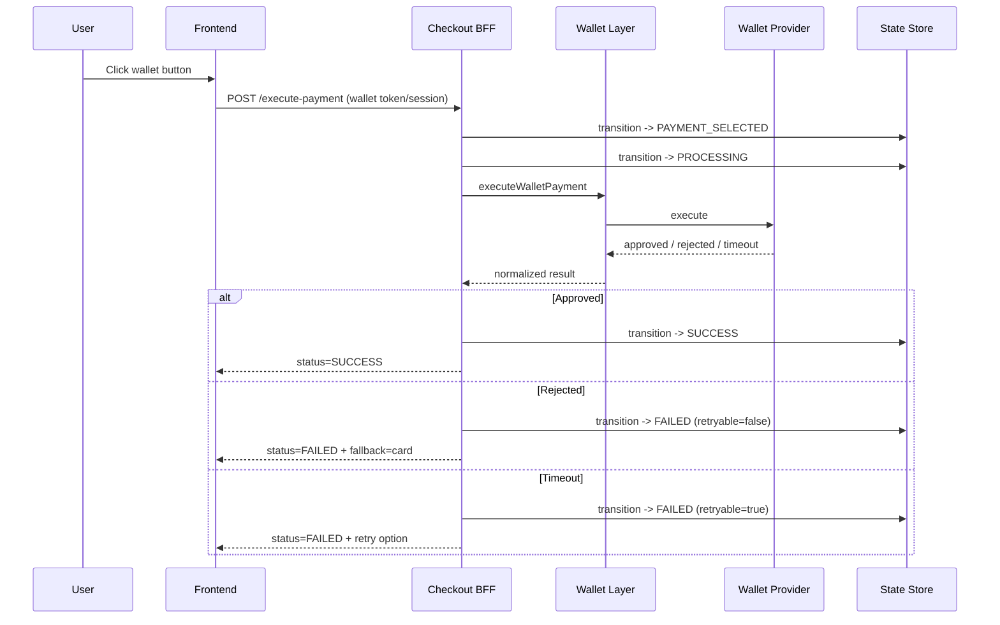

# Wallet Payment Sequence

## Wallet-Specific Considerations
- Provider sessions can expire quickly; include expiry awareness in UI.
- Wallet callbacks must be signature-verified.
- If wallet fails repeatedly, surface card fallback by default.
