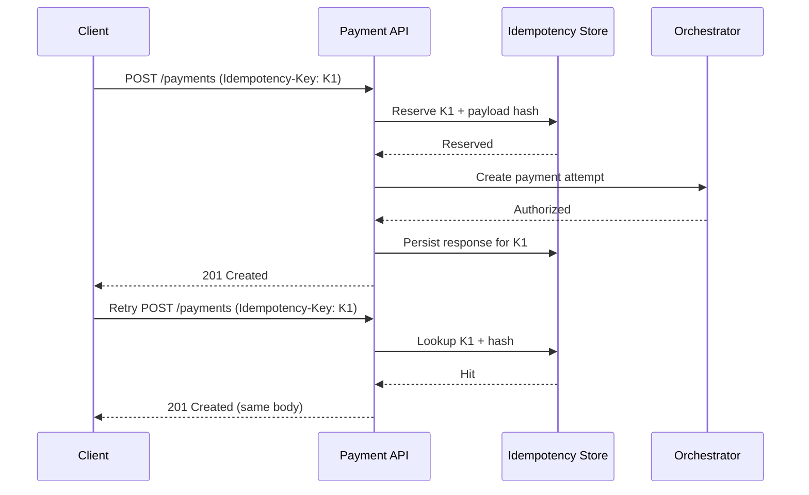

# Idempotency Strategy

Idempotency prevents duplicate charges during retries from clients, networks, or orchestration services.

## Contract
- Clients send `Idempotency-Key` for create/capture/refund requests.
- Key scope: `merchant_id + operation + key`.
- Server returns same response payload for repeated requests with identical key and body.

## Behavior Matrix
- Same key + same payload: return original response.
- Same key + different payload: return conflict error.
- Missing key (for mutating endpoints): reject request.

## Retention and Expiry
- Suggested key retention: 24 hours for authorization operations.
- Longer retention for capture/refund can reduce finance reconciliation disputes.

## Sequence Diagram

## Product Notes
- Idempotency should be mandatory in mobile SDK integrations where network retries are common.
- Observability must track idempotency hit rate and conflict rate.
