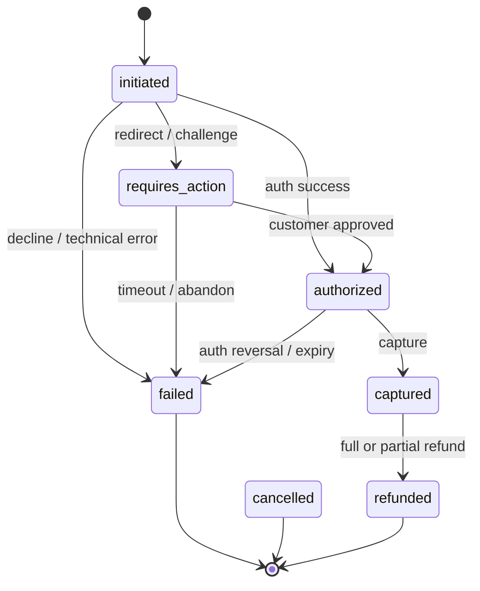

# Payment State Machine

Defines a channel-agnostic payment lifecycle for card, PayPal, and Apple Pay across web, web mobile, and mobile.

## Canonical States
- `initiated` — payment intent created
- `requires_action` — additional customer interaction needed (3DS, wallet approval)
- `authorized` — funds reserved
- `captured` — funds captured
- `failed` — terminal unsuccessful state
- `cancelled` — customer/system cancellation
- `refunded` — full or partial reversal after capture

## Transition Rules
- `initiated -> requires_action` when method requires step-up or redirect.
- `initiated -> authorized` when synchronous auth succeeds.
- `requires_action -> authorized` on successful challenge/approval callback.
- `authorized -> captured` via auto-capture policy or explicit capture command.
- Any non-terminal state can move to `failed` on timeout, decline, or technical error.
- `captured -> refunded` when merchant or support triggers refund.

## Method-Specific Notes
- **Card**: often reaches `authorized` synchronously; may require 3DS.
- **PayPal**: commonly moves through `requires_action` due to redirect/approval.
- **Apple Pay**: tokenization is immediate, but downstream auth behavior mirrors card rails.

## State Diagram

## Product Guardrails
- Single canonical state model across channels to reduce analytics ambiguity.
- Only one terminal outcome for a payment attempt.
- Provider event mapping is normalized before state mutation.
