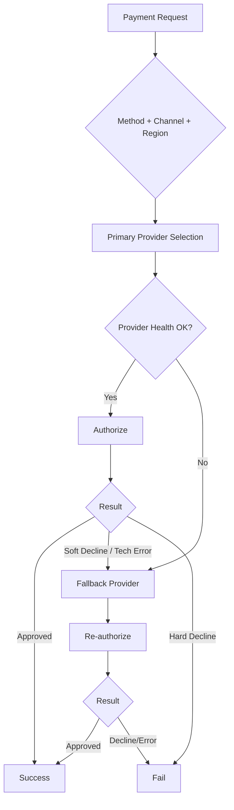

# Provider Routing

Routing policy for selecting payment providers while balancing conversion, latency, and cost.

## Objectives (Priority Order)
1. Maximize successful authorization rate.
2. Maintain latency SLO by channel.
3. Control processing cost after conversion guardrails are met.

## Routing Inputs
- Payment method: card, PayPal, Apple Pay
- Channel: web, web mobile, mobile
- Region and currency
- BIN metadata (for card)
- Real-time provider health (error rate, p95 latency)
- Historical performance segment (issuer x method x country)

## Decision Policy
- Use **primary provider** per segment under healthy conditions.
- Trigger **fallback** on technical failures and selected soft declines.
- Avoid fallback for hard declines (insufficient funds, stolen card indicators).
- Cap retry chain to prevent customer churn and duplicate attempts.

## High-Level Routing Diagram

## Operational Constraints
- Feature flags control rollout by market and method.
- Real-time kill switch can isolate a provider.
- Routing decisions must be logged with reason codes for auditability.
