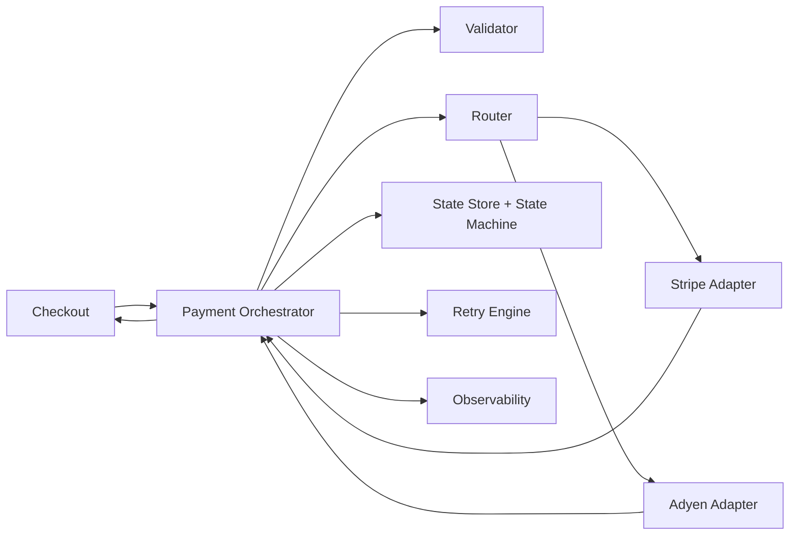
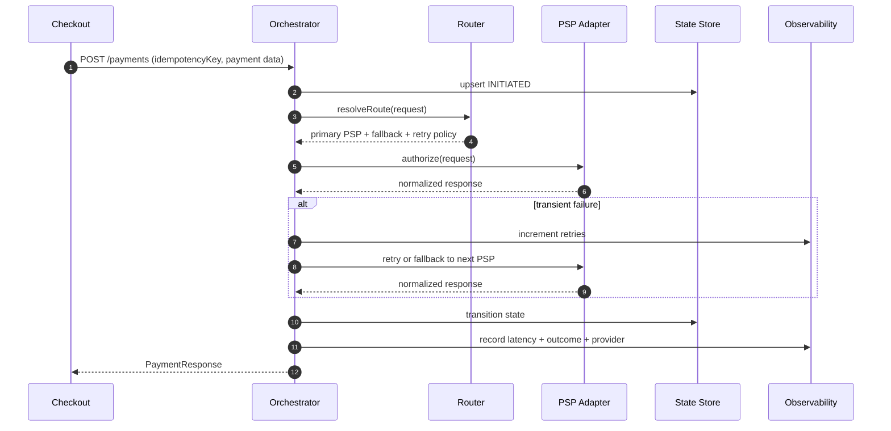

# Payment Orchestration

A pseudo-realistic reference repository for a **payment orchestration layer** that decouples checkout from payment providers.

## Elevator Pitch

This project models an orchestration layer that abstracts multiple PSPs, applies routing rules, handles tokenization, 3DS, retries, and payment state transitions in a single flow independent from checkout.

## Objectives

- Decouple checkout from provider-specific integrations.
- Simulate multiple PSPs behind a unified interface.
- Model retries and fallback routing.
- Define an explicit payment state machine.
- Demonstrate observability and key metrics.
- Showcase idempotency and resilience patterns.

## Repository Structure

```text
payment-orchestration/
 ├─ docs/
 ├─ orchestration/
 ├─ routing/
 ├─ providers/
 ├─ state-machine/
 ├─ contracts/
 ├─ observability/
 └─ examples/
```

## End-to-End Flow (High Level)

1. Checkout sends `PaymentRequest` with an idempotency key.
2. Orchestrator validates input contract and business constraints.
3. Router evaluates rules (country, amount, risk, A/B split).
4. Orchestrator calls selected PSP adapter.
5. Adapter returns normalized `PaymentResponse`.
6. Retry engine decides whether to retry / fallback on transient failures.
7. State is persisted in the payment state store.
8. Metrics, logs, and traces are emitted.
9. Checkout receives final normalized status.

## Architecture Snapshot



## Sequence Diagram



## Idempotency and Resilience

- **Idempotency:** keyed by `merchantId + idempotencyKey`, with deduped response replay.
- **Retries:** exponential backoff for retryable failures (`NETWORK_ERROR`, `TIMEOUT`, `RATE_LIMIT`).
- **Fallback:** alternate PSP selected by routing policy.
- **Circuit breaking:** provider health contributes to routing score.

## Disclaimer

This repository models a generic payment orchestration layer.

All provider names, routing logic, and flows are fictional or generalized.
No production architecture is reproduced.
No proprietary contracts are included.
No real endpoints or credentials exist.
This project is for educational and portfolio purposes only.
