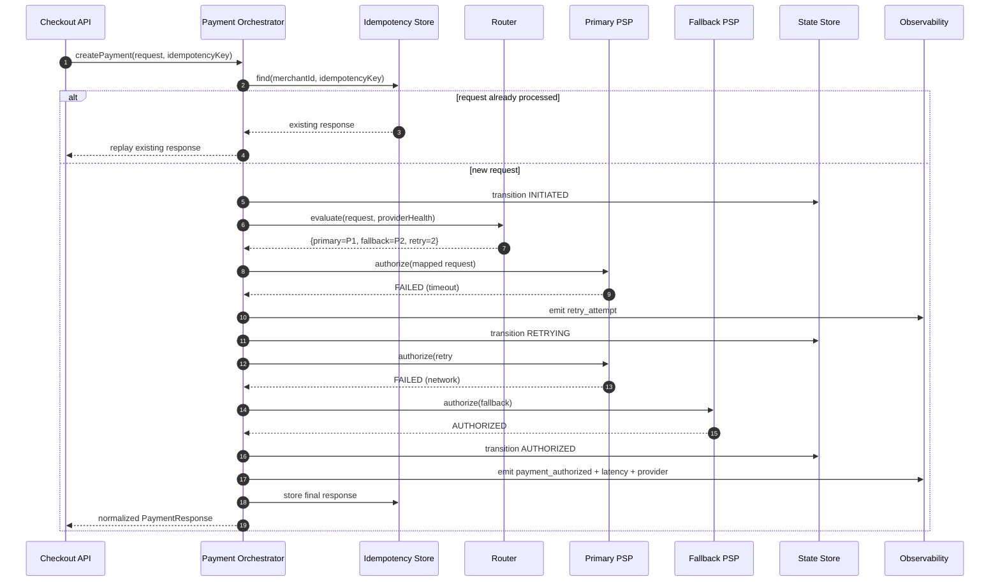

# Architecture

## Components

### 1. Orchestrator
Responsible for driving the payment lifecycle:

- Contract validation.
- Idempotency lookup and replay.
- Routing strategy selection.
- Provider execution lifecycle.
- Retry + fallback decisions.
- State persistence and publication.

### 2. Router
Uses declarative rules and provider health signals to decide:

- Primary provider.
- Fallback provider.
- Retry policy.
- Optional traffic-splitting strategy.

### 3. PSP Adapters
Provider-specific wrappers implementing a common interface:

- Request mapping to provider schema.
- Provider API invocation.
- Response normalization.
- Provider error classification.

### 4. State Store
Persists payment aggregate snapshots and transitions:

- Current status.
- Transition history.
- Attempt metadata by provider.
- Idempotent replay payload.

### 5. Retry Engine
Applies resilience policy:

- Retryable vs non-retryable failure classification.
- Exponential backoff.
- Maximum attempts.
- Fallback trigger logic.

## Design Principles

- **Checkout decoupling:** checkout never depends on PSP-specific contracts.
- **Single normalized contract:** one input and one output shape.
- **Deterministic state transitions:** every response maps to state machine events.
- **Observability-first:** every attempt emits structured events.

## End-to-End Detailed Sequence

## Non-Goals

- Real PSP SDK integration.
- PCI production-grade token vault implementation.
- Production-grade anti-fraud or risk scoring.
