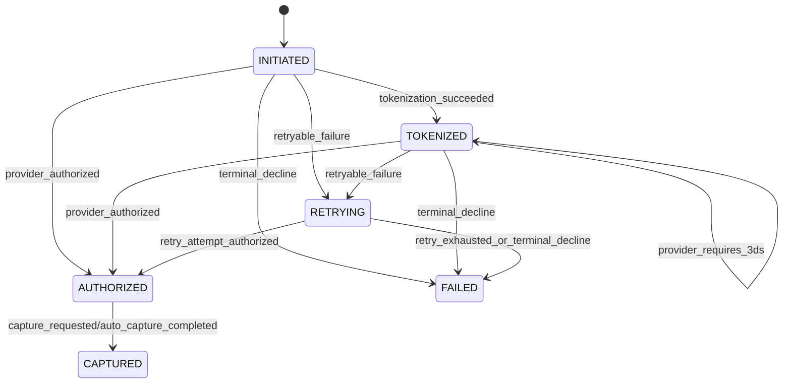

# Payment State Machine

## States

- `INITIATED`: Request accepted and idempotency validated.
- `TOKENIZED`: Payment method token recognized / prepared (or challenge initiated).
- `AUTHORIZED`: Funds reserved by PSP.
- `CAPTURED`: Funds captured (for auto-capture or separate capture step).
- `FAILED`: Terminal failure.
- `RETRYING`: Temporary state while retry policy is active.

## Transition Rules

| From       | Event                               | To             | Notes |
|------------|-------------------------------------|----------------|-------|
| INITIATED  | tokenization_succeeded              | TOKENIZED      | Token checks passed. |
| INITIATED  | provider_authorized                 | AUTHORIZED     | Direct auth without explicit token stage. |
| TOKENIZED  | provider_requires_3ds               | TOKENIZED      | Self-transition while challenge is pending. |
| TOKENIZED  | provider_authorized                 | AUTHORIZED     | 3DS completed or skipped. |
| AUTHORIZED | capture_requested (manual)          | CAPTURED       | Separate capture command accepted. |
| AUTHORIZED | auto_capture_completed              | CAPTURED       | Auto-capture merchant configuration. |
| *          | retryable_failure                   | RETRYING       | Timeout/rate-limit/network issues. |
| RETRYING   | retry_attempt_authorized            | AUTHORIZED     | Retry succeeded. |
| RETRYING   | retry_exhausted_or_terminal_decline | FAILED         | No more attempts or non-retryable decline. |
| INITIATED  | terminal_decline                    | FAILED         | Non-retryable error at first attempt. |
| TOKENIZED  | terminal_decline                    | FAILED         | Non-retryable error after token stage. |

## Behavioral Notes

- Transitions are append-only and should be audit-friendly.
- Every transition carries metadata: `provider`, `attempt`, `reasonCode`, `timestamp`.
- `FAILED` is terminal for authorization flow; a new attempt requires a new payment intent.

## State Diagram

