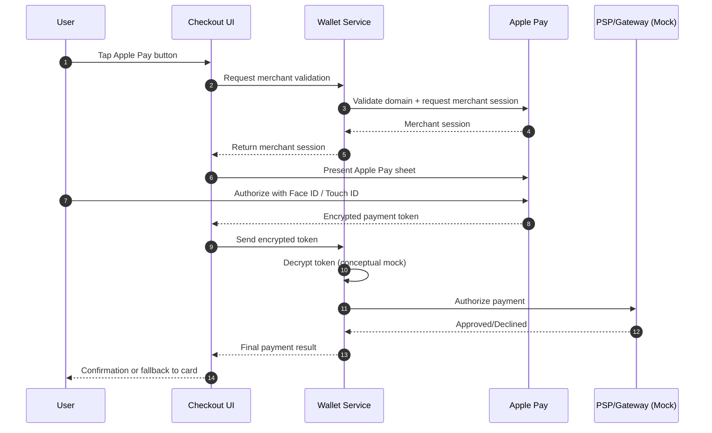

# Apple Pay Sequence (Conceptual)

## Flow Summary

User tap → merchant validation → token decrypt → authorization.

## Sequence Diagram

## Failure Paths

- Merchant validation fails → do not show Apple Pay sheet.
- Token decryption fails → return `error` and offer card fallback.
- Authorization declined → offer retry or fallback payment method.
